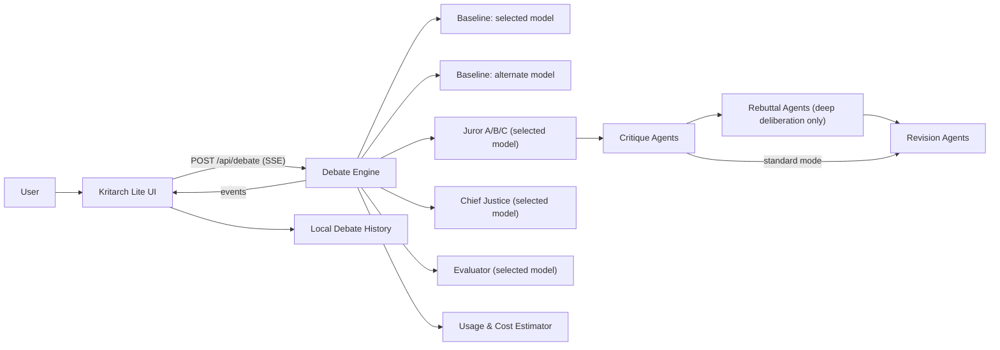
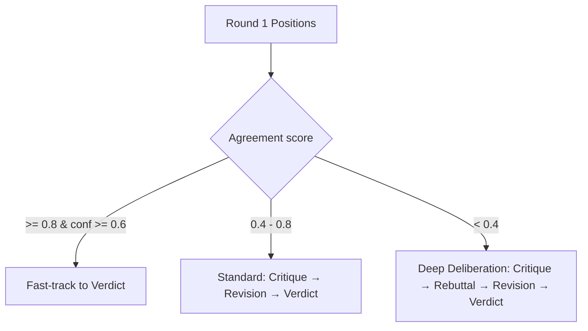

# Kritarch Lite — AI Jury

When your team needs to work through a complex question — whether to enter a market, challenge a clause, or change a treatment plan — the usual path is slow: delegate, wait, reconcile. Kritarch Lite gives you a panel of AI agents that analyze the problem from competing angles, challenge each other's reasoning, and deliver a structured verdict. You review the conclusion, not the process.

## Live demo

https://kritarch-lite-production.up.railway.app/

## Name and pronunciation

- Pronounced: "KRIT-ark lite".
- Meaning in this project: critique-led adjudication where answers are governed by structured debate, revision, and consensus.

## Why Kritarch Lite

Kritarch Lite is designed for high-stakes domains where a single-model answer is not enough. It makes reasoning more auditable by forcing disagreement discovery, explicit critique, and a final consensus verdict.

## UI highlights

- **Command-center roster:** introduces the three specialists (Cautious Analyst, Devil's Advocate, Pragmatic Expert).
- **Jury chamber:** explains how the Chief Justice synthesizes a final verdict.
- **Jury Verdict payload:** Verdict, Key evidence, Risk flags, and Next actions, plus agreement/confidence.
- **Baselines vs Jury:** side-by-side single-model baselines with a structured, decision-ready jury output.
- **Domain suggestion:** keyword-based detection suggests a likely domain and lets the user apply it.

## Why multi-agent debate in healthcare, finance, and legal

- **Healthcare:** Patient safety and regulatory expectations demand transparent, evidence-aware reasoning and clear risk caveats.
- **Finance:** Model risk management requires independent challenge and governance of automated decisions.
- **Legal:** Professional competence and real-world sanctions for AI hallucinations make verification non-negotiable.

## Use cases

| Domain     | Example use cases                                                                                                        |
| ---------- | ------------------------------------------------------------------------------------------------------------------------ |
| Healthcare | Guideline comparisons, triage risk framing, trial eligibility screening, patient-facing explanations (with human review) |
| Finance    | Investment thesis stress tests, credit memos with risk flags, compliance checks, scenario analysis                       |
| Legal      | Argument mapping, contract clause risk review, policy compliance summaries, case law outlines                            |

## Simple use case (finance: lending)

A bank needs to decide whether to approve a loan. It must follow government SOPs and the bank's own SOPs. Kritarch Lite helps by:

- Collecting the right information (borrower profile, cash flow, collateral, policy limits).
- Having agents debate the lending risks, policy fit, and missing evidence.
- Producing a clear Go / No-Go recommendation with reasons and red flags for humans to review.

## Human team analogy (corporate decision-making)

In many companies, a team tackles a complex problem by delegating research to team members and seniors, regrouping to compare findings, and then presenting a final recommendation to stakeholders. Kritarch Lite mirrors this workflow with AI agents: they split the work, debate evidence, and reassemble a consensus. The difference is speed and scale — it is faster, runs 24/7, and can cover a broader scope. Human-in-the-loop remains intact so stakeholders make the final decision with a clearer, better-coordinated view.

## Architecture



## Coordination modes

After Round 1 positions, the engine computes an agreement score and selects one of three coordination modes:

| Mode                  | Trigger                                | Rounds executed                                      |
| --------------------- | -------------------------------------- | ---------------------------------------------------- |
| **Fast-track**        | Agreement >= 80% and confidence >= 60% | Positions → Verdict (critique + revision skipped)    |
| **Standard**          | 40% <= Agreement < 80%                 | Positions → Critique → Revision → Verdict            |
| **Deep deliberation** | Agreement < 40%                        | Positions → Critique → Rebuttal → Revision → Verdict |



## Glossary

| Term                  | Description                                                                                                                           |
| --------------------- | ------------------------------------------------------------------------------------------------------------------------------------- |
| **Baseline**          | Two single-model baselines: selected model (fairness) and alternate model (contrast)                                                  |
| **Jurors**            | Three agents with distinct reasoning styles (Cautious Analyst, Devil's Advocate, Pragmatic Expert)                                    |
| **Chief Justice**     | Aggregates juror outputs into the final verdict                                                                                       |
| **Key evidence**      | Evidence points supporting the verdict                                                                                                |
| **Next actions**      | Concrete follow-up steps to move the decision forward                                                                                |
| **Fast-track**        | Coordination mode that skips critique and revision when agreement is high                                                             |
| **Standard mode**     | Default coordination path with critique and revision rounds                                                                           |
| **Deep deliberation** | Extra-thorough mode triggered by low agreement (< 40%); adds a rebuttal round                                                         |
| **Rebuttal**          | Round in deep deliberation where jurors concede valid critiques, defend strong arguments, and refine positions before formal revision |
| **Coordination**      | Agreement-based control that selects fast-track, standard, or deep deliberation                                                       |
| **Evaluation**        | Independent scoring that compares the jury output to the selected-model baseline                                                      |
| **Safety guardrails** | Preflight prompt-injection heuristics + moderation checks; unsafe requests are blocked                                                |
| **Redaction**         | Output content is masked if unsafe or if the safety service is unavailable                                                            |

## Research & supporting evidence

See [spec/WHY_KRITARCH_LITE.md](spec/WHY_KRITARCH_LITE.md) for the full rationale, use cases, and citations.

## Tech stack

- Next.js (App Router), Tailwind
- OpenAI Agents SDK + Zod structured outputs
- SSE streaming API
- Dockerized for Railway deployment

## Requirements

- Node.js >= 22

## Environment

Copy the sample file and fill in your values:

```bash
cp .env.example .env
```

```bash
OPENAI_API_KEY=your_key
OPENAI_MODEL=gpt-5.2
OPENAI_BASELINE_MODEL=gpt-5-mini
OPENAI_PRICING_OVERRIDES=
LOG_LEVEL=debug
LOG_SAMPLE_RATE=1
LOG_TRUNCATE_LENGTH=200
```

Optional pricing overrides (for cost estimates only): `OPENAI_PRICING_OVERRIDES` accepts JSON mapping model prefixes to `inputUsdPer1M`/`outputUsdPer1M`.

## Model policy (quality-first default)

- **Jurors + Chief Justice + Evaluator:** selected model (`gpt-5.2` by default, `gpt-5-mini` optional)
- **Baseline (selected model):** matches the selected model
- **Baseline (alternate model):** the other model (`gpt-5.2` <-> `gpt-5-mini`)
- Sampling params (like `temperature`) are only sent when the model supports them.

## Codex memory

`spec/KRITARCH_LITE_BUILD_PLAN.md` acts as project memory for Codex. Keep it current and concise so Codex can stay aligned across sessions.

## Config validation

Runtime configuration is validated at startup using Zod. Missing or invalid
variables will cause the server to fail fast with a clear error. Use
`.env.example` as the baseline for required keys.

## Run locally

```bash
npm install
npm run dev
```

## Run with Docker

```bash
docker build -t kritarch-lite .
docker run -p 3000:3000 -e OPENAI_API_KEY=... kritarch-lite
```

## API

- `GET /api/health` → `{ "status": "ok" }`
- `POST /api/debate` → `text/event-stream` SSE
- `GET /api/samples` → sample prompts (16 total, 4 per domain)

Example:

```bash
curl -N -X POST http://localhost:3000/api/debate \
  -H "Content-Type: application/json" \
  -d '{"query":"Should a fund manager increase NVIDIA exposure given AI regulation uncertainty?","domain":"finance","model":"gpt-5.2"}'
```

Sample prompts:

```bash
curl http://localhost:3000/api/samples
```

## Security scaffolds

- Strict input validation via Zod
- Basic in‑memory rate limiting per IP
- Security headers applied on all routes
- Safety guardrails: prompt-injection heuristics, moderation gate, and output redaction
- No secrets exposed to the client

## Safety & jailbreak resistance

- Preflight guardrails: prompt-injection heuristics + OpenAI moderation gate (fail-closed if unavailable).
- Output guardrails: structured rounds are screened and redacted if unsafe.
- Agent prompts explicitly enforce instruction hierarchy and refusal of hidden/system prompt requests.
- Jailbreak tests included in the Vitest suite to prevent regressions.
- UI banner explains blocked requests and suggests safe rephrasing.

## Railway deployment (Docker)

1. Connect repo in Railway
2. Select Dockerfile deploy
3. Set env vars: `OPENAI_API_KEY`, `OPENAI_MODEL`, `OPENAI_BASELINE_MODEL`

## Demo steps

1. Paste or type a question (domain suggestion may appear)
2. Choose a domain or click **Apply** on the suggestion
3. Click **Start Debate**
4. Watch Round 1–3 stream live
5. Review the Jury Verdict + Comparison panel with evaluator scores

## Suggested demo prompt

Legal: "Should AI-generated content be completely banned from use as evidence in US courtrooms?"
